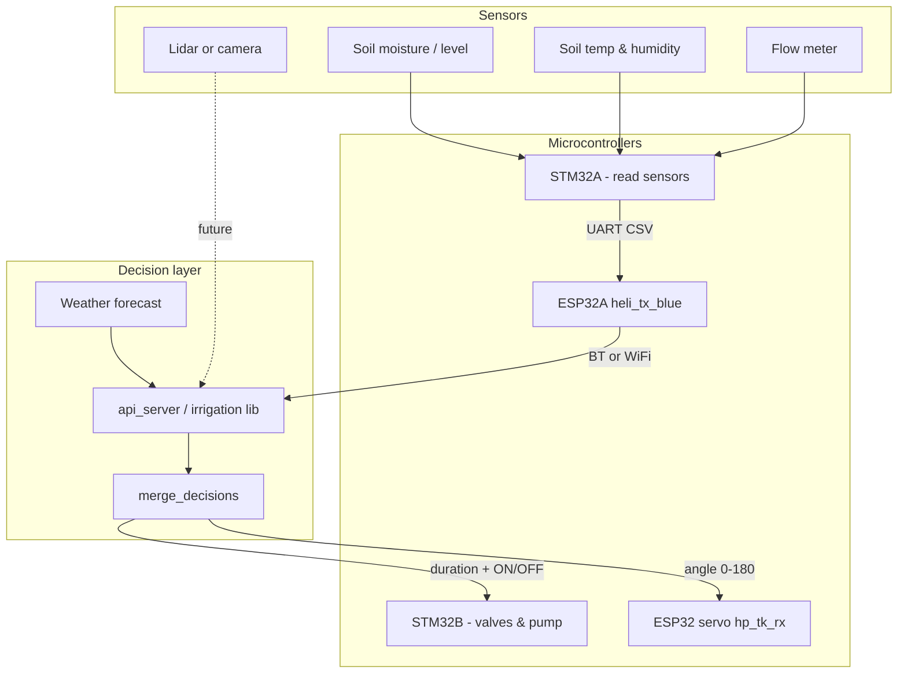

# Smart Sprinkler — Overall Architecture

Unified structure for **Waterlytics / Smart Sprinkler**: how sensing, analysis, scheduling, and actuation fit together across firmware (`pre_code/ESP32_TASK` → `firmware/`), Python services (`services/`, `scripts/`), and future vision modules.

**Related docs**

| Document | Focus |
|----------|--------|
| [architecture.md](./architecture.md) | Overall system design |
| [firmware_consolidation.md](./firmware_consolidation.md) | How ESP32 `.ino` files merge |
| [irrigation_schedule_design.md](./irrigation_schedule_design.md) | Weather rules, GPM assumptions, duration tables |
| [irrigation_api.md](./irrigation_api.md) | Python library + HTTP API usage |
| [Proposal site](https://collegeappivy.wixsite.com/wateranalytics) | Product vision & pillars |

---

## 1. System goals (from proposal)

| Pillar | Intent | Primary layer |
|--------|--------|----------------|
| **Development** | AI-assisted logic, integration, UX | Software + firmware |
| **Production** | Smart sprinkler hardware, targeted watering | Firmware + mechanics |
| **Business** | Deployment, scaling, analytics | Cloud / dashboard (future) |

**Core idea:** Treat irrigation as a **closed loop** — sense conditions → decide if/ how long / where to water → actuate valves, pump, and nozzle angle → log results.

---

## 2. High-level architecture

```text
┌─────────────────────────────────────────────────────────────────────────────┐
│                           FIELD / HARDWARE LAYER                            │
├─────────────────────────────────────────────────────────────────────────────┤
│  Soil & flow sensors ──► STM32A ──UART──► ESP32A (heli_tx_blue)             │
│                                              │ BT / WiFi (future)            │
│  Lidar scan (optional) ◄── ESP32 scan node (uart/plane prototypes)          │
│  Camera (future) ◄── edge vision node                                       │
│  Deflector / nozzle angle ◄── ESP32 + servo (hp_tk_rx) or STM32B drivers    │
│  Pump / zone valve ◄── STM32B or relay board                                │
└─────────────────────────────────────────────────────────────────────────────┘
                                      │
                                      ▼
┌─────────────────────────────────────────────────────────────────────────────┐
│                         EDGE / GATEWAY (optional)                           │
├─────────────────────────────────────────────────────────────────────────────┤
│  ESP32B (heli_rc_blue)  OR  Laptop / RPi  OR  Phone                         │
│  Role: receive telemetry, forward commands, run API locally                 │
└─────────────────────────────────────────────────────────────────────────────┘
                                      │
                                      ▼
┌─────────────────────────────────────────────────────────────────────────────┐
│                         DECISION & ANALYSIS LAYER                           │
├─────────────────────────────────────────────────────────────────────────────┤
│  services/irrigation/                                                       │
│    weather.py   ← Open-Meteo (rain, humidity) → duration cap / rain skip    │
│    soil.py      ← CSV from STM32 → need water? duration factor              │
│    merge.py     ← final ON/OFF + minutes                                    │
│  Future: vision.py (grass border, dry patches) → aim angle                    │
│  Future: dashboard / ML training pipeline                                     │
└─────────────────────────────────────────────────────────────────────────────┘
                                      │
                                      ▼
┌─────────────────────────────────────────────────────────────────────────────┐
│                         ACTUATION COMMANDS                                  │
├─────────────────────────────────────────────────────────────────────────────┤
│  { sprinkler_on, duration_minutes, nozzle_angle?, zone_id? }                │
│  → BLE (hp_tk_tx/rx)  OR  Serial  OR  MQTT (future)  → hardware             │
└─────────────────────────────────────────────────────────────────────────────┘
```

---

## 3. End-to-end data flow (target production path)



**Sensor CSV format** (already used in `heli_tx_blue` / `heli_rc_blue`):

```text
voltage,current,flowRate,waterLevel,soilTemp,humidity
```

---

## 4. Decision model (three inputs → one output)

| Input | Source (today) | Controls | Future |
|-------|----------------|----------|--------|
| **When / how long** | Soil + weather merge | Pump ON, valve time | + ET model, user schedule |
| **Whether to skip** | Rain forecast (hard), wet soil (hard) | OFF tonight | + local rain gauge |
| **Where / direction** | Not in merge yet | Nozzle deflector angle | Camera border or lidar (`uart.ino` prototype) |

### Merge priority (implemented in `services/irrigation/merge.py`)

```text
1. Rain tonight or tomorrow        → OFF (no override)
2. Soil already wet                → OFF
3. Soil dry + weather allows       → ON, duration = min(weather_min, soil_min)
4. Soil critically dry             → minimum run even if weather soft-skip
```

### Output contract (stable for API + firmware)

```json
{
  "sprinkler_on": true,
  "duration_minutes": 10,
  "duration_seconds": 600,
  "duration": "10 min (600 sec)",
  "decision_source": "merged_min",
  "skip_reason": null,
  "recommended_start": "22:00 local",
  "nozzle_angle_deg": null
}
```

`nozzle_angle_deg` reserved for vision / lidar module (not implemented yet).

---

## 5. Hardware map — `pre_code/ESP32_TASK/` (legacy prototypes)

| Folder | Role today | Production role | Keep / refactor / replace |
|--------|------------|-----------------|---------------------------|
| `heli_tx_blue/` | STM32A → BT server | **Field gateway**: sensor uplink | **Keep** → add WiFi option |
| `heli_rc_blue/` | BT → STM32B serial | **Remote gateway** (only if no laptop) | **Optional** — skip if laptop is receiver |
| `sashuiji/hp_tk_tx/` | Serial → BLE angle | **Command TX** from laptop | **Keep** for servo tests |
| `sashuiji/hp_tk_rx/` | BLE → servo GPIO13 | **Nozzle / deflector actuator** | **Keep** → production servo node |
| `uart/` | Lidar sweep + width + pose | **Spatial**: block spray at edges | **Prototype** → vision or cleaned lidar service |
| `plane/` | Lidar read test | Dev/test only | Archive or merge into `uart/` |
| `sketch_nov26a/` | Early scan width | Dev/test only | Archive |
| `wifi/` | Serial2 VOFA demo | Misnamed; not WiFi | Replace with real WiFi uplink later |
| `4pi_shoubing/` | Dual joystick | Manual override / debug | Optional operator input |

**Important:** `heli_rc_blue` does **not** control the sprinkler — it only forwards CSV. Control logic belongs in **Python merge** + **STM32B** + **hp_tk_rx**.

---

## 6. Software / code structure (current + planned)

### 6.1 Repository layout (today)

```text
smart_sprinkler/
├── README.md
├── requirements.txt                 # FastAPI server deps
├── docs/
│   ├── architecture.md              # This file
│   ├── irrigation_schedule_design.md
│   └── irrigation_api.md
├── scripts/
│   ├── fetch_weather.py             # Open-Meteo client + CLI
│   ├── sprinkler_schedule.py          # Weather-only CLI
│   ├── analyze_soil.py                # Soil + merged CLI
│   ├── api_server.py                  # HTTP API (FastAPI)
│   ├── irrigation_config.example.json
│   └── irrigation/                    # ★ Decision library (source of truth)
│       ├── __init__.py                # get_final_decision_api(), etc.
│       ├── config.py                  # Thresholds, GPM defaults
│       ├── types.py                   # SoilReading, *Decision dataclasses
│       ├── weather.py                 # Forecast → WeatherDecision
│       ├── soil.py                    # Sensor → SoilDecision
│       └── merge.py                   # → FinalIrrigationDecision
└── pre_code/ESP32_TASK/               # Legacy firmware prototypes
    ├── heli_tx_blue/
    ├── heli_rc_blue/
    ├── sashuiji/
    └── ...
```

### 6.2 Target layout (recommended evolution)

```text
smart_sprinkler/
├── firmware/                        # Production sketches (port from pre_code/ESP32_TASK)
├── pre_code/                        # Legacy ESP32_TASK prototypes (reference)
│   ├── gateway/
│   │   ├── sensor_uplink/           # heli_tx_blue (+ WiFi variant)
│   │   └── optional_relay/          # heli_rc_blue if needed
│   ├── actuator/
│   │   ├── servo_ble_rx/            # hp_tk_rx
│   │   └── servo_ble_tx/            # hp_tk_tx
│   └── perception/                    # lidar / camera prototypes
│       ├── lidar_scan/              # uart.ino cleaned
│       └── README.md
├── services/
│   ├── irrigation/                  # Decision library (weather + soil + merge)
│   ├── api/                         # FastAPI server (scripts/api_server.py CLI)
│   └── weather/                     # Open-Meteo client
├── apps/
│   └── dashboard/                   # Future: web UI, Water Analytics
├── ml/                              # Future: vision training, grass segmentation
│   ├── datasets/
│   └── models/
├── tests/
│   ├── test_soil.py
│   ├── test_weather.py
│   └── test_merge.py
└── configs/
    └── irrigation.default.json
```

**Principle:** One **decision library** (`irrigation/`), multiple **interfaces** (CLI, HTTP, future MQTT subscriber).

### 6.3 Module dependency graph

```text
services/weather/client.py
       │
       ▼
services/irrigation/weather.py ──► WeatherDecision
       │
services/irrigation/soil.py    ◄── SoilReading (CSV / JSON / heli pipeline)
       │
       ▼
services/irrigation/merge.py     ──► FinalIrrigationDecision
       │
       ├── scripts/analyze_soil.py (CLI)
       ├── scripts/api_server.py → services/api/server.py (HTTP)
       └── future: mqtt_bridge.py, scheduler cron
```

---

## 7. Interface layers

| Interface | Entry point | Consumer |
|-----------|-------------|----------|
| **Library** | `from services.irrigation import get_final_decision_api` | Your soil analysis script |
| **CLI** | `analyze_soil.py`, `sprinkler_schedule.py` | Developer / cron |
| **HTTP** | `POST /v1/irrigation/decision` | ESP32 bridge, mobile app |
| **Serial / BLE** | hp_tk_tx → hp_tk_rx | Nozzle angle (parallel path) |
| **Future MQTT** | `irrigation/command` topic | Distributed nodes |

---

## 8. Deployment topologies

### Topology A — Laptop-centric (simplest for development)

```text
STM32A → ESP32A (heli_tx) ──BT──► Laptop
                                     ├── irrigation API / analyze_soil
                                     ├── Open-Meteo weather
                                     └── USB → hp_tk_tx → BLE → hp_tk_rx (servo)
```

- **Skip** `heli_rc_blue`
- Good for: analysis, demos, FBLA / proposal phase

### Topology B — Two-board wireless bridge

```text
STM32A → ESP32A ──BT── ESP32B (heli_rc) → STM32B → pump/valves
```

- Good for: fixed install without PC always on
- **Still need** decision logic on STM32B or add WiFi on ESP32B calling API

### Topology C — Production (recommended target)

```text
STM32A → ESP32A ──WiFi/MQTT──► Edge server (RPi or cloud)
                                    └── irrigation API
Weather ◄── Open-Meteo ──────────────┘
Commands ──MQTT──► STM32B (valve) + ESP32 servo (angle)
Camera/lidar ──► vision service ──► nozzle_angle_deg
```

---

## 9. Subsystem responsibilities

| Subsystem | Question it answers | Technology |
|-----------|---------------------|------------|
| **STM32A + sensors** | Is the soil dry? Is water flowing? | ADC, I2C sensors |
| **Weather service** | Will it rain? Is air humid? | `fetch_weather` / Open-Meteo |
| **Soil analyzer** | How much water does the plant need? | `irrigation/soil.py` |
| **Merge engine** | Final ON/OFF + minutes? | `irrigation/merge.py` |
| **Actuator: valve/pump** | Run for N minutes | STM32B + relay |
| **Actuator: deflector** | Aim / block spray sector | Servo (`hp_tk_rx`) |
| **Vision (future)** | Where is grass vs sidewalk? | Camera + CV model |
| **Lidar (prototype)** | Obstacle width / edge proxy | `uart.ino` |

---

## 10. Phased roadmap

| Phase | Deliverable | Repo location |
|-------|-------------|---------------|
| **P0 — Done** | Weather + soil merge, API, docs | `scripts/`, `docs/` |
| **P1** | Port `pre_code/ESP32_TASK` into `firmware/` by role | `firmware/` |
| **P2** | WiFi uplink on ESP32A (replace BT-only for laptop) | `firmware/gateway/` |
| **P3** | MQTT command down to STM32B + servo | `services/mqtt_bridge.py` |
| **P4** | Web dashboard (Water Analytics UI) | `apps/dashboard/` |
| **P5** | Camera grass-border → `nozzle_angle_deg` | `ml/`, `irrigation/vision.py` |
| **P6** | Close loop: log water used vs moisture delta | DB + analytics |

---

## 11. Configuration & tuning

| Parameter | File | Notes |
|-----------|------|-------|
| Base run time (min) | `irrigation/config.py` | Default 20 |
| Zone flow (GPM) | CLI / config JSON | Measure with bucket test |
| Soil wet/dry thresholds | `irrigation/config.py` | Calibrate to your sensor |
| Rain skip % | `irrigation/config.py` | Align with Hydrawise-style 50% |
| Watering window | `irrigation/config.py` | Default 22:00–06:00 |
| GPIO / pins | firmware sketches | Per board wiring doc |

---

## 12. What to build next (recommended order)

1. **Stabilize API** — run `api_server.py` on laptop; point soil script at `POST /v1/irrigation/decision`.
2. **Port `pre_code/ESP32_TASK` → `firmware/`** — rename sketches by role; add wiring README.
3. **Single command path** — merge output drives both **valve duration** (STM32B) and **servo angle** (hp_tk_rx).
4. **WiFi telemetry** — ESP32A posts CSV to API instead of BT-only.
5. **Vision module** — new `irrigation/vision.py` feeding `nozzle_angle_deg` into merge (direction only; duration still from soil+weather).

---

## 13. Summary diagram — “one picture”

```text
         ┌──────────────┐
         │   WEATHER    │  humidity, rain forecast
         └──────┬───────┘
                │
         ┌──────▼───────┐      ┌──────────────┐
         │    MERGE     │◄─────│     SOIL     │  level, temp, humidity, flow
         │  (Python)    │      └──────▲───────┘
         └──────┬───────┘             │
                │              STM32A → ESP32 gateway
                │
    ┌───────────┼───────────┐
    │           │           │
    ▼           ▼           ▼
 duration    valve/      nozzle angle
 (minutes)    pump       (servo / future vision)
```

This repository today implements the **MERGE** box and documents the rest. Legacy firmware lives under `pre_code/ESP32_TASK/`; production firmware should grow under `firmware/` following the roles above.
